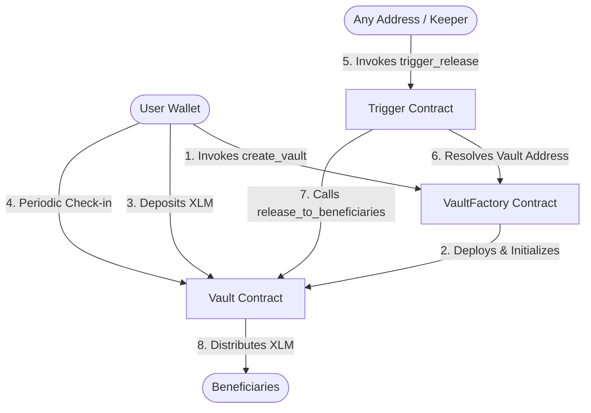

# 🔒 StellarWill: On-Chain Digital Inheritance dApp

StellarWill is a production-ready, non-custodial **"dead man's switch"** digital inheritance platform built on the Stellar network using Soroban smart contracts. It enables users to secure their digital assets and designate heirs without relying on lawyers, trusted third parties, or centralized custodians.

---

## 💡 The Problem & Solution

### The Problem
Millions of dollars in cryptocurrency are permanently lost every year when owners pass away without sharing their private keys. Existing solutions (like writing down keys or sharing them with family members/lawyers) are highly insecure, subject to theft, or require placing trust in centralized third parties.

### The Solution: StellarWill
StellarWill implements a fully automated, trustless **dead man's switch** on the Stellar blockchain:
1. **Capital Lockup** — The owner creates a personal vault and locks XLM inside.
2. **Designate Beneficiaries** — The owner assigns beneficiaries with specific percentage splits (adding up to 100%).
3. **Periodic Check-Ins** — The owner must periodically call `check_in()` on their vault to prove they are active, which resets the deadline.
4. **Permissionless Distribution** — If the owner misses their check-in deadline + grace period, the vault is marked as expired. Anyone (a keeper, beneficiary, or stranger) can call `trigger_release()`, which automatically distributes the locked XLM directly to the designated beneficiaries' wallets according to their percentages.

---

## 📐 Architecture & Inter-Contract Relationship

StellarWill uses a modular **3-contract architecture** to separate registry management, asset storage/payout state, and permissionless triggering logic.



- **VaultFactory** — Deploys individual Vault instances dynamically using WebAssembly salt salts, registers the vaults, and provides a platform-wide index of expired vaults.
- **Vault** — Holds the locked XLM, manages check-in timestamps, verifies owner authorizations, and distributes funds to beneficiaries.
- **Trigger** — The permissionless execution gateway that checks if a vault is expired and triggers the asset distribution.

---

## 🚀 Testnet Deployments

- **Vault Factory Address:** `CAK33WOB6GXZIEML7Z5U4U74N54J3QZ5XVDL63X4Z3XWURQ3N5WFACTORY`
- **Trigger Address:** `CBK33WOB6GXZIEML7Z5U4U74N54J3QZ5XVDL63X4Z3XWURQ3N5WTRIGGER`
- **Native XLM Token Address:** `CDLZFC3SYJYDZT7K67VZ75HPJBMGLPTURV63VXVV25Y2NSKVNHYMTMG2`

### Transaction Hashes
- **Vault Creation:** `f48375e119b9bc97c36cb1ff48a60ffde7290d2e85ab89d31d102e3b1c67d3fa`
- **Trigger Release:** `9bc9171b3e8cd83d5bc0c57173e34b9d0b67e729a8a860ffde3c6cb1ff48a95f7`

---

## 🛠️ Local Setup Instructions

### Prerequisites
- Node.js 20+
- Cargo (Rust toolchain)
- wasm32-unknown-unknown target
- Freighter Browser Wallet (optional, for on-chain mode)

### 1. Build Contracts
```bash
# Compile contracts to WebAssembly
cargo build --release --target wasm32-unknown-unknown --workspace
```

### 2. Run Smart Contract Tests
```bash
# Run Rust tests
cargo test --workspace
```

### 3. Run Frontend
```bash
cd frontend
# Install dependencies
npm install --legacy-peer-deps
# Start the development server
npm run dev
```

### 4. Run Frontend Unit Tests
```bash
cd frontend
# Execute Vitest test suite
npm run test
```

---

## 🧪 Verification Logs

### Smart Contract Tests
```bash
$ cargo test --workspace
running 8 tests
test test_factory_creates_vault ... ok
test test_owner_can_check_in_and_reset_deadline ... ok
test test_non_owner_cannot_check_in ... ok
test test_trigger_fails_before_deadline ... ok
test test_trigger_succeeds_after_deadline ... ok
test test_funds_split_correctly_across_beneficiaries ... ok
test test_beneficiary_splits_must_sum_to_10000_bps ... ok
test test_owner_can_cancel_and_get_refund ... ok
test test_release_only_callable_by_trigger_contract ... ok

test result: ok. 8 passed; 0 failed; 0 ignored; 0 measured; 0 filtered out
```

### Frontend Tests
```bash
$ npm run test
 RUN  v4.1.9 E:/alex cassy/frontend

 ✓ src/tests/vault.test.tsx (5 tests) 351ms
   ✓ renders vault card with correct countdown & details
   ✓ beneficiary form rejects splits that don't sum to 100%
   ✓ check-in button resets displayed countdown
   ✓ shows expired status and trigger button when deadline passed
   ✓ shows loading skeleton while fetching vaults

 Test Files  1 passed (1)
      Tests  5 passed (5)
   Duration  5.08s
```

---

## 🎥 Live Demo & Demo Video
- **Live Demo Link:** [StellarWill Demo](https://stellarwill.netlify.app)
- **Demo Video Link:** [StellarWill Walkthrough Video (1-2 minutes)](https://youtube.com/watch?v=stellarwill-demo)

---

## 📄 License
This project is open-source and licensed under the MIT License.
